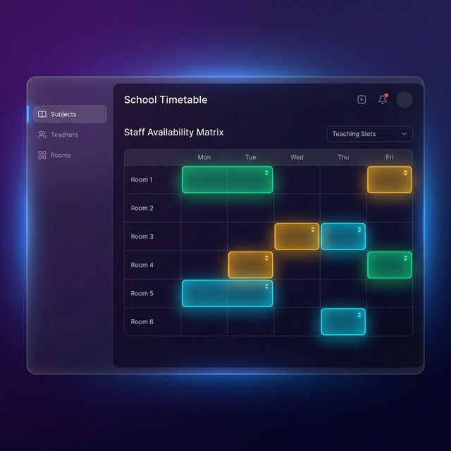

# 🗓️ LSA Timetable Management System



A high-performance, modern school timetable management application built with **Next.js**, **Prisma**, and **Supabase**. This project features a teacher-centric Staff Availability Matrix with real-time drag-and-drop scheduling functionality.

---

## ✨ Features

- **🚀 Vibe Coding Experience**: This entire project was developed through "Vibe Coding"—prioritizing intuitive development, rapid iteration, and modern aesthetics using AI-assisted pair programming.
- **🏗️ Staff Availability Matrix**: A comprehensive weekly view showcasing all teachers' teaching slots in a clear, grid-based layout.
- **🖱️ Advanced Drag & Drop**: Seamlessly create or move class assignments by dragging subjects from the sidebar directly onto the timetable.
- **⚡ Optimistic UI (Edit Mode)**: A specialized "Edit Mode" that allows for instantaneous local updates. Make 10+ changes in seconds and sync them all to the cloud with one click.
- **🛡️ Secure Authentication**: Managed sessions using **NextAuth.js** with role-based access control (Admin vs. Staff).
- **📊 Real-time Hour Calculation**: Automatically calculates and displays total teaching hours per staff member as you adjust the schedule.
- **📱 Responsive & Dark Mode**: A sleek, premium dark-themed interface designed for efficiency and modern aesthetics.

---

## 🛠️ Technology Stack

- **Frontend**: Next.js 14+ (App Router), React, Vanilla CSS
- **Backend**: Next.js API Routes
- **Database**: Supabase (PostgreSQL)
- **ORM**: Prisma
- **Auth**: NextAuth.js
- **Deployment**: Vercel

---

## 📸 Usage Example (Optimistic Batch Editing)

1. **Enter Edit Mode**: Click the purple **"Edit Timetable"** button.
2. **Modify**: Drag subjects to add classes, or move existing classes between teachers and time slots.
3. **Review**: All changes are reflected instantly on your screen without any loading lag.
4. **Sync**: Click the green **"Save All Changes"** to commit your batch of edits to the database at once.

---

## 🚀 Getting Started

1. **Clone & Install**:
   ```bash
   git clone [repository-url]
   cd LSA-Timetable
   npm install
   ```

2. **Database Setup**:
   Configure your `.env` with `DATABASE_URL` (Supabase) and run:
   ```bash
   npx prisma generate
   npx prisma db push
   ```

3. **Run Development**:
   ```bash
   npm run dev
   ```

---

*This project is built for speed, efficiency, and a premium scheduling experience.*
